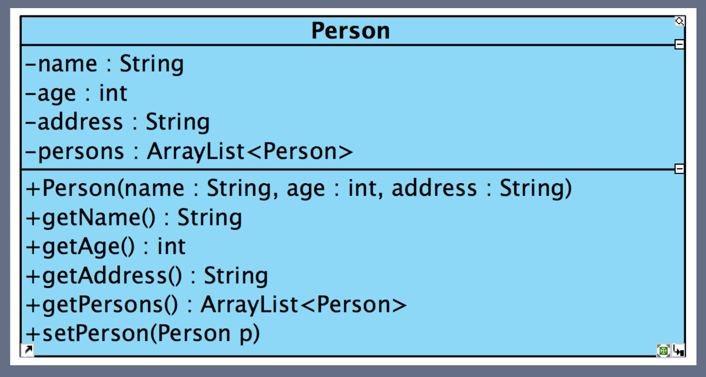
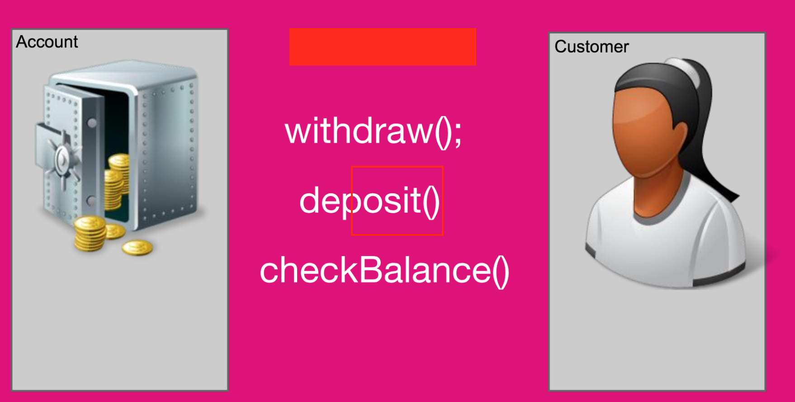

# High Cohesion

 > Cohesion is a measure of how strongly related and focused the responsibilities of an element are.
 > A class with low cohesion does many unrelated activities or does too much work.

## High or Low Cohesion?

